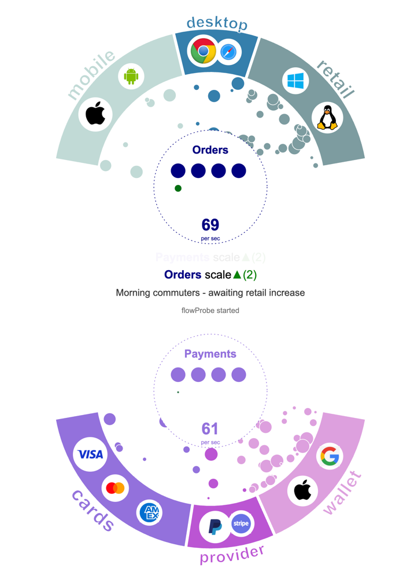

# flowProbe

Live visualisation using **d3.js** that visualises flow of data around two entities (e.g. `Orders` and `Payments`) from their respective sources (logos in the arcs) to their respective services (circle in the centre) which display the current scaling (a node/circle grid). 
Each service displays the current per-sec rate of the flow. 

## Live demo

[touchfeed.github.io/flowProbe](https://touchfeed.github.io/flowProbe/)

## Structure

Relevant folders : 
- `data` - holds the configuration of input sources (logos in the arcs) and services
- `fp` - the actual logic & drawings using d3.js
- `server` - a mocked Python server serving SSE connections for simulations driven via socket rather than browser 

`index.js` is the starting point which wires the data together with flowProbe instance.
